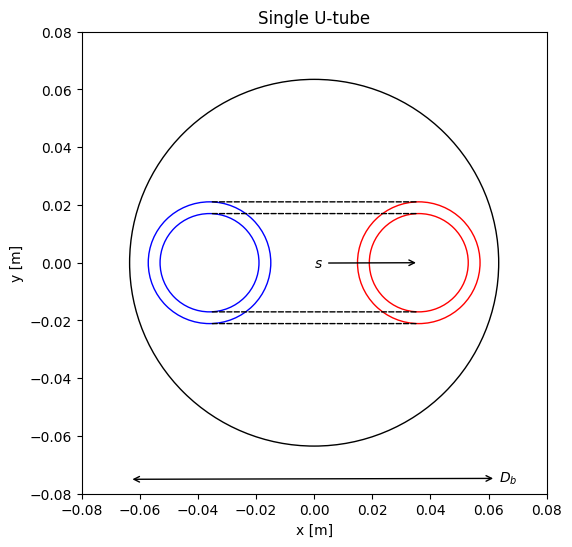
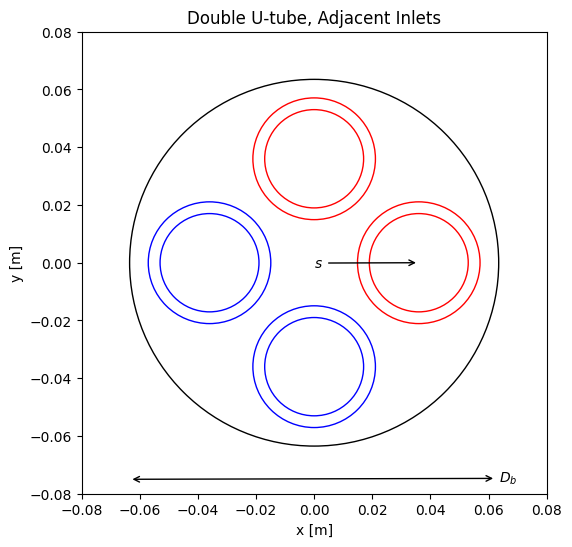
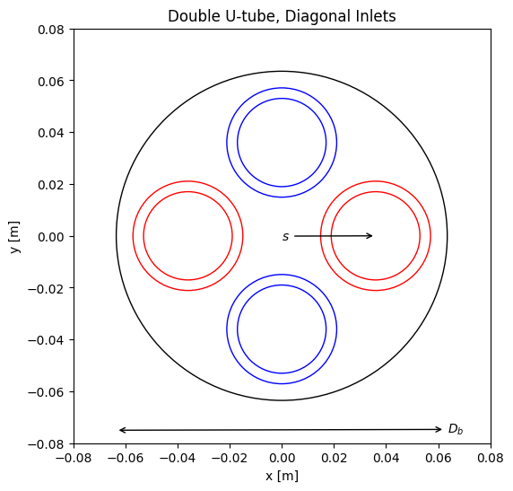
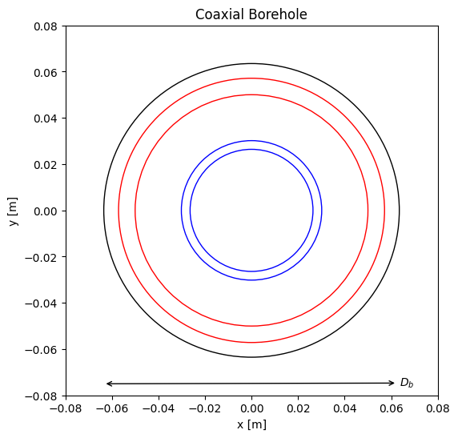

Preferred Programmatic Usage
============================

For programmatic usage, the preferred approach is for users to directly consume
the borehole class directly in your applications.

Example usage for a single u-tube borehole::

    from bhr.borehole import Borehole

    single_bhr = Borehole()
    single_bhr.init_single_u_borehole(
        borehole_diameter=0.127,
        pipe_outer_diameter=0.032,
        pipe_dimension_ratio=11,
        length=200,
        shank_space=0.032,
        pipe_conductivity=0.4,
        grout_conductivity=1.6,
        soil_conductivity=2.0,
        fluid_type="PROPYLENEGLYCOL",
        fluid_concentration=0.2,
    )

    m_flow_borehole = 0.5 # kg/s
    temp = 20 # celsius
    print(f"{single_bhr.calc_bh_resist(m_flow_borehole, temp):0.5f}")

Note: Shank spacing `s` is reference from the borehole center to the tube center.

Example usage for double u-tube borehole::

    from bhr.borehole import Borehole

    double_bhr = Borehole()
    double_bhr.init_double_u_borehole(
        borehole_diameter=0.127,
        pipe_outer_diameter=0.032,
        pipe_dimension_ratio=11,
        length=200,
        shank_space=0.032,
        pipe_conductivity=0.4,
        pipe_inlet_arrangement="DIAGONAL",
        grout_conductivity=1.6,
        soil_conductivity=2.0,
        fluid_type="PROPYLENEGLYCOL",
        fluid_concentration=0.2,
        boundary_condition="UNIFORM_BOREHOLE_WALL_TEMP",
    )

    m_flow_borehole = 0.5 # kg/s
    temp = 20 # celsius
    print(f"{double_bhr.calc_bh_resist(m_flow_borehole, temp):0.5f}")

Example usage for coaxial borehole::

    from bhr.borehole import Borehole

    coaxial_bhr = Borehole()
    coaxial_bhr.init_coaxial_borehole(
        borehole_diameter=0.127,
        outer_pipe_outer_diameter=0.114,
        outer_pipe_dimension_ratio=17,
        outer_pipe_conductivity=0.4,
        inner_pipe_outer_diameter=0.06,
        inner_pipe_dimension_ratio=11,
        inner_pipe_conductivity=0.4,
        length=200,
        grout_conductivity=1.6,
        soil_conductivity=2.0,
        fluid_type="PROPYLENEGLYCOL",
        fluid_concentration=0.2,
    )

    m_flow_borehole = 0.5 # kg/s
    temp = 20 # celsius
    print(f"{coaxial_bhr.calc_bh_resist(m_flow_borehole, temp):0.5f}")

.. toctree::
   :maxdepth: 2
